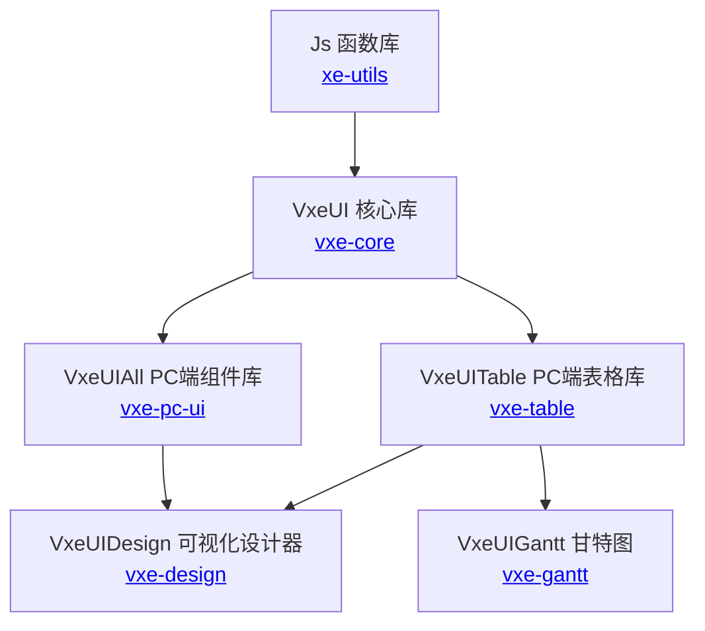
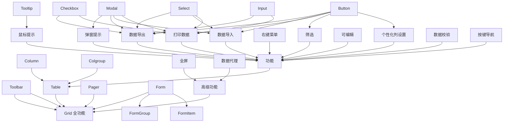
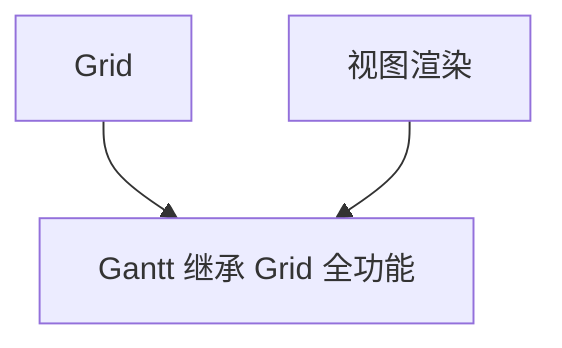
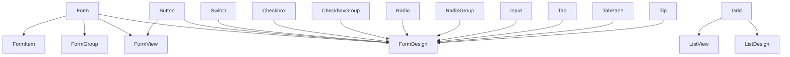

## Vxe 组件架构

```mermaid
graph TD;
    xe-utils[Js 函数库<br><a href="https://github.com/x-extends/xe-utils" target="_blank">xe-utils</a>]-->vxe-core[VxeUI 核心库<br><a href="https://github.com/x-extends/vxe-core" target="_blank">vxe-core</a>];
    vxe-core-->vxe-pc-ui[VxeUIAll PC端组件库<br><a href="https://github.com/x-extends/vxe-pc-ui" target="_blank">vxe-pc-ui</a>];
    vxe-core-->vxe-table[VxeUITable PC端表格库<br><a href="https://github.com/x-extends/vxe-table" target="_blank">vxe-table</a>];
    vxe-table-->vxe-gantt[VxeUIGantt 甘特图<br><a href="https://github.com/x-extends/vxe-gantt" target="_blank">vxe-gantt</a>];
    vxe-pc-ui-->vxe-design[VxeUIDesign 可视化设计器<br><a href="https://github.com/x-extends/vxe-design" target="_blank">vxe-design</a>];
    vxe-table-->vxe-design;
```
## Vxe Table 组件依赖图

```mermaid
graph TD;
    Toolbar-->Grid[Grid 全功能];
    Table-->Grid;
    Column-->Table;
    Colgroup-->Table;
    Pager-->Grid;
    Form-->Grid;
    Form-->FormGroup;
    Form-->FormItem;
    Toolbar-->Grid;
    gFunc[高级功能]-->Grid;
    zoom[全屏]-->gFunc;
    proxy[数据代理]-->gFunc;
    modules[功能]-->Table;
    tip[鼠标提示]-->modules;
    Tooltip-->tip;
    modal[弹窗提示]-->modules;
    Modal-->modal;
    export[数据导出]-->modules;
    Button-->export;
    Checkbox-->export;
    Select-->export;
    Input-->export;
    Modal-->export;
    import[数据导入]-->modules;
    Button-->import;
    Modal-->import;
    Select-->import;
    print[打印数据]-->modules;
    Button-->print;
    Checkbox-->print;
    Select-->print;
    Input-->print;
    Modal-->print;
    menu[右键菜单]-->modules;
    filter[筛选]-->modules;
    Button-->filter;
    edit[可编辑]-->modules;
    custom[个性化列设置]-->modules;
    Button-->custom;
    Vvalidator[数据校验]-->modules;
    keyboard[按键导航]-->modules;
```

## Vxe Gantt 组件依赖图

```mermaid
graph TD;
    Grid-->Gantt[Gantt 继承 Grid 全功能];
    chat[视图渲染]-->Gantt;
```

## Vxe Design 设计器组件依赖图

```mermaid
graph TD;
    Form-->FormGroup;
    Form-->FormItem;
    Form-->FormDesign;
    Button-->FormDesign;
    Switch-->FormDesign;
    Checkbox-->FormDesign;
    CheckboxGroup-->FormDesign;
    Radio-->FormDesign;
    RadioGroup-->FormDesign;
    Input-->FormDesign;
    Tab-->FormDesign;
    TabPane-->FormDesign;
    Tip-->FormDesign;
    Form-->FormView;
    Button-->FormView;
    Grid-->ListDesign;
    Grid-->ListView;
```